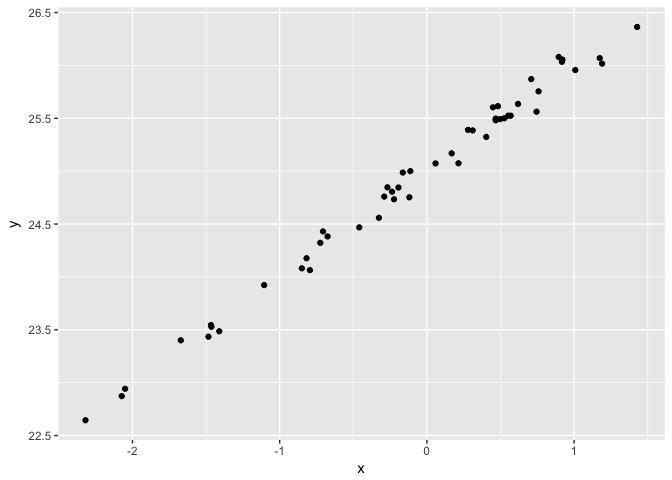
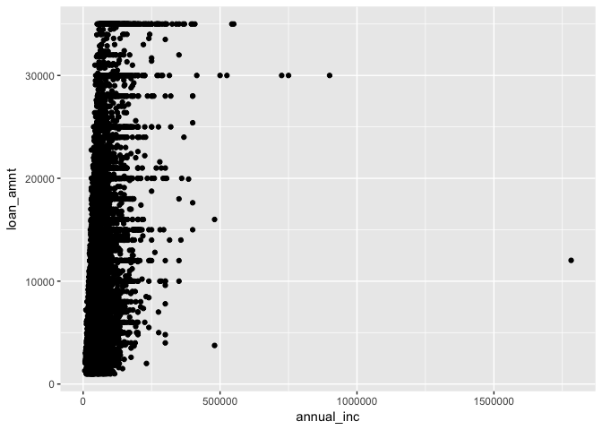
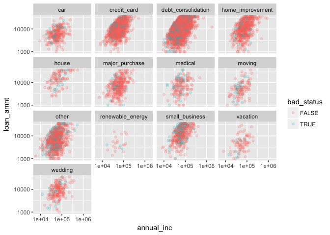
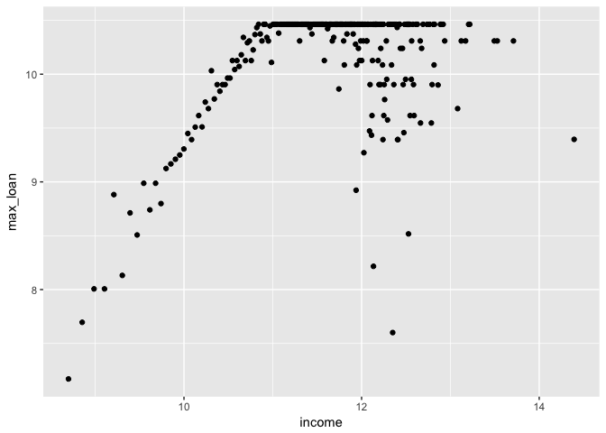
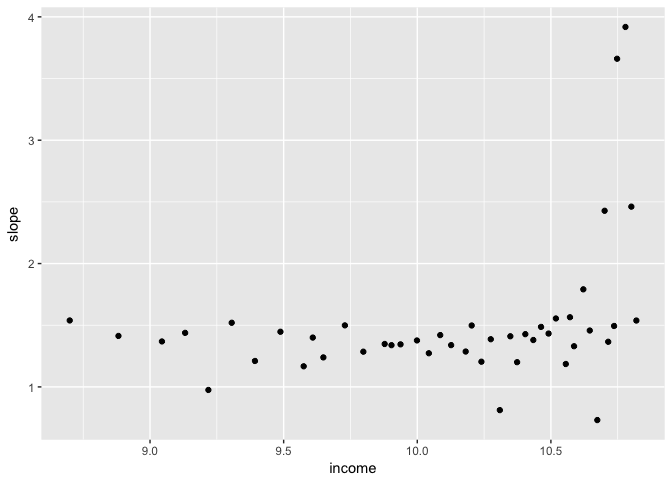

Section 1: dplyr
================
Jonathan Page

-   [Efficient R for Data Exploration](#efficient-r-for-data-exploration)
-   [Basic R Intro](#basic-r-intro)
-   [Basic visual exploration](#basic-visual-exploration)
-   [Loading data](#loading-data)
    -   [SQLite example](#sqlite-example)
    -   [More dplyr](#more-dplyr)
    -   [The decision boundary](#the-decision-boundary)

Efficient R for Data Exploration
================================

Basic R Intro
=============

The basic container of data in R is the vector. Vectors in R can be defined directly with the function `c()`:

``` r
x <- c(1, 2, 3, 4)
y <- c(5, 6)
x + y
```

    ## [1]  6  8  8 10

Observe above that the two vectors are added element-wise and that the shorter vector is recycled.

View a complete list of basic operators by running the following command:

    ?+.

Specify a seed for the pseudo-random number generator, take draws from two normally distributed random variables, and find their correlation.

``` r
set.seed(101)

x <- rnorm(50)
y <- x + rnorm(50, mean = 25, sd = 0.1)

cor(x, y)
```

    ## [1] 0.995099

Look at summary statistics for these random variables:

``` r
summary(x)
```

    ##     Min.  1st Qu.   Median     Mean  3rd Qu.     Max. 
    ## -2.31933 -0.71980 -0.02713 -0.12397  0.54596  1.42776

``` r
mean(x)
```

    ## [1] -0.1239708

``` r
var(x)
```

    ## [1] 0.8688974

``` r
sqrt(var(x))
```

    ## [1] 0.9321467

``` r
sd(x)
```

    ## [1] 0.9321467

Basic visual exploration
========================

Load `ggplot2` and plot scatterplots of the random variables:

``` r
library(ggplot2)

df <- data.frame(cbind(x, y))
summary(df)
```

    ##        x                  y        
    ##  Min.   :-2.31933   Min.   :22.64  
    ##  1st Qu.:-0.71980   1st Qu.:24.34  
    ##  Median :-0.02713   Median :25.04  
    ##  Mean   :-0.12397   Mean   :24.88  
    ##  3rd Qu.: 0.54596   3rd Qu.:25.55  
    ##  Max.   : 1.42776   Max.   :26.36

``` r
ggplot(df, aes(x, y)) + geom_point()
```



Loading data
============

SQLite example
--------------

The following [SQLite](https://www.sqlite.org/) database was downloaded from Kaggle at <https://www.kaggle.com/wendykan/lending-club-loan-data>

The data is available in SQLite format, so we will make use of the `RSQLite` package

``` r
#install.packages("RSQLite")
library(RSQLite)
mydb <- dbConnect(RSQLite::SQLite(), "data/lending-club.sqlite")
dbListTables(mydb)
```

    ## [1] "loan"

``` r
dbListFields(mydb, "loan")
```

    ##  [1] "index"                       "id"                         
    ##  [3] "member_id"                   "loan_amnt"                  
    ##  [5] "funded_amnt"                 "funded_amnt_inv"            
    ##  [7] "term"                        "int_rate"                   
    ##  [9] "installment"                 "grade"                      
    ## [11] "sub_grade"                   "emp_title"                  
    ## [13] "emp_length"                  "home_ownership"             
    ## [15] "annual_inc"                  "verification_status"        
    ## [17] "issue_d"                     "loan_status"                
    ## [19] "pymnt_plan"                  "url"                        
    ## [21] "desc"                        "purpose"                    
    ## [23] "title"                       "zip_code"                   
    ## [25] "addr_state"                  "dti"                        
    ## [27] "delinq_2yrs"                 "earliest_cr_line"           
    ## [29] "inq_last_6mths"              "mths_since_last_delinq"     
    ## [31] "mths_since_last_record"      "open_acc"                   
    ## [33] "pub_rec"                     "revol_bal"                  
    ## [35] "revol_util"                  "total_acc"                  
    ## [37] "initial_list_status"         "out_prncp"                  
    ## [39] "out_prncp_inv"               "total_pymnt"                
    ## [41] "total_pymnt_inv"             "total_rec_prncp"            
    ## [43] "total_rec_int"               "total_rec_late_fee"         
    ## [45] "recoveries"                  "collection_recovery_fee"    
    ## [47] "last_pymnt_d"                "last_pymnt_amnt"            
    ## [49] "next_pymnt_d"                "last_credit_pull_d"         
    ## [51] "collections_12_mths_ex_med"  "mths_since_last_major_derog"
    ## [53] "policy_code"                 "application_type"           
    ## [55] "annual_inc_joint"            "dti_joint"                  
    ## [57] "verification_status_joint"   "acc_now_delinq"             
    ## [59] "tot_coll_amt"                "tot_cur_bal"                
    ## [61] "open_acc_6m"                 "open_il_6m"                 
    ## [63] "open_il_12m"                 "open_il_24m"                
    ## [65] "mths_since_rcnt_il"          "total_bal_il"               
    ## [67] "il_util"                     "open_rv_12m"                
    ## [69] "open_rv_24m"                 "max_bal_bc"                 
    ## [71] "all_util"                    "total_rev_hi_lim"           
    ## [73] "inq_fi"                      "total_cu_tl"                
    ## [75] "inq_last_12m"

``` r
dbGetQuery(mydb, "SELECT COUNT(*) FROM loan;")
```

    ##   COUNT(*)
    ## 1   887383

``` r
dbGetQuery(mydb, "SELECT addr_state, MIN(loan_amnt), MAX(loan_amnt), AVG(loan_amnt), COUNT(*) FROM loan GROUP BY addr_state;")
```

    ##    addr_state MIN(loan_amnt) MAX(loan_amnt) AVG(loan_amnt) COUNT(*)
    ## 1        <NA>             NA             NA             NA        1
    ## 2          AK           1000          35000      16770.091     2205
    ## 3          AL            600          35000      14698.897    11200
    ## 4          AR            500          35000      14068.686     6640
    ## 5          AZ            600          35000      14212.723    20412
    ## 6          CA            500          35000      14655.610   129518
    ## 7          CO            750          35000      14946.210    18807
    ## 8          CT           1000          35000      14999.390    13531
    ## 9          DC           1000          35000      15167.958     2432
    ## 10         DE           1000          35000      14701.752     2511
    ## 11         FL            500          35000      13932.700    60935
    ## 12         GA            500          35000      14946.627    29086
    ## 13         HI           1000          35000      15211.444     4570
    ## 14         IA           1850          19500       8148.214       14
    ## 15         ID           2000          25000       7362.500       12
    ## 16         IL            500          35000      15195.300    35476
    ## 17         IN           1000          35000      14685.177    13789
    ## 18         KS            500          35000      14685.324     7926
    ## 19         KY           1000          35000      14284.687     8550
    ## 20         LA            800          35000      14822.676    10587
    ## 21         MA           1000          35000      15679.056    20594
    ## 22         MD           1000          35000      15475.093    21031
    ## 23         ME           1200          35000      15489.190      525
    ## 24         MI           1000          35000      14203.515    22985
    ## 25         MN           1000          35000      14334.364    15957
    ## 26         MO            600          35000      14420.200    14207
    ## 27         MS           1000          35000      14938.138     3819
    ## 28         MT           1000          35000      13798.710     2558
    ## 29         NC            900          35000      14639.083    24720
    ## 30         ND           1025          35000      15547.599      479
    ## 31         NE            700          35000      14587.628     1176
    ## 32         NH           1000          35000      14801.095     4294
    ## 33         NJ            550          35000      15493.535    33256
    ## 34         NM           1000          35000      14914.553     4939
    ## 35         NV            800          35000      13859.967    12443
    ## 36         NY            500          35000      14536.376    74086
    ## 37         OH           1000          35000      14264.634    29631
    ## 38         OK           1000          35000      14842.675     8085
    ## 39         OR           1000          35000      13710.833    10893
    ## 40         PA           1000          35000      14514.155    31393
    ## 41         RI           1000          35000      14141.331     3893
    ## 42         SC           1000          35000      14821.750    10639
    ## 43         SD            700          35000      13717.121     1815
    ## 44         TN           1000          35000      14897.311    12887
    ## 45         TX            500          35000      15591.239    71138
    ## 46         UT           1000          35000      14664.136     6264
    ## 47         VA            500          35000      15662.619    26255
    ## 48         VT           1000          35000      14008.542     1797
    ## 49         WA            600          35000      14885.040    19434
    ## 50         WI           1000          35000      14291.157    11574
    ## 51         WV           1000          35000      14654.121     4386
    ## 52         WY           1000          35000      15321.881     2028

``` r
loan10k <- dbGetQuery(mydb, "SELECT * FROM loan LIMIT 10000;")
# loan <- dbReadTable(mydb, "loan") # to grab the whole thing
dbDisconnect(mydb)
```

The above SQL, `SELECT * FROM loan LIMIT 10000;`, translates to requesting all all fields (or columns) from the `loan` table, limiting our result to the first 10,000 records.

Summarize the loan data. Let's focus on two variables, the reported annual income, `annual_inc`, and the loan amount, `loan_amnt`.

``` r
summary(loan10k$annual_inc)
```

    ##    Min. 1st Qu.  Median    Mean 3rd Qu.    Max. 
    ##    6000   42000   60000   70266   84500 1782000

``` r
ggplot(loan10k, aes(annual_inc)) + geom_histogram() + geom_rug()
```

    ## `stat_bin()` using `bins = 30`. Pick better value with `binwidth`.


From the above plot, it should be clear the data is not normal. Let's take the log of annual income and loan amount.

``` r
library(dplyr)
```

    ## 
    ## Attaching package: 'dplyr'

    ## The following objects are masked from 'package:stats':
    ## 
    ##     filter, lag

    ## The following objects are masked from 'package:base':
    ## 
    ##     intersect, setdiff, setequal, union

``` r
loan10k$ln_annual_inc <- log(loan10k$annual_inc) 
loan10k$ln_loan_amnt <- log(loan10k$loan_amnt) 
summary(loan10k$loan_amnt)
```

    ##    Min. 1st Qu.  Median    Mean 3rd Qu.    Max. 
    ##    1000    6000   11200   12862   17500   35000

``` r
loan10k %>%
  ggplot(aes(annual_inc, loan_amnt)) + geom_point()
```



Compare the above scatterplot with the following on the log scale.

``` r
ggplot(loan10k, aes(annual_inc, loan_amnt)) + geom_point() + scale_x_log10() + scale_y_log10()
```


Let's explore these by the stated purpose.

``` r
loan10k %>% mutate(bad_status = loan_status %in% c("Charged Off", "Default")) %>%
ggplot(aes(annual_inc, loan_amnt, color = bad_status)) + geom_point(alpha = 0.2) + facet_wrap(~ purpose) +
  scale_x_log10() + scale_y_log10()
```



This analysis gave us an immediate sense of some important features of the data.

1.  There are upper and lower caps on the loan amount.
2.  The max loan amount is proportional to income for incomes below some amount.
3.  The loan limit is a binding constraint for some loan purposes and not others.

More dplyr
----------

Let's make use of `dplyr` to group the loans by some income groups in the log scale. The goal will be to make vertical slices and calculate the maximum loan amount for each slice. We can then estimate the decision rule made by the bank. Note that there appear to be deviations above the cap for some lower income levels.

Group by income level:

``` r
library(dplyr)
loan10k %>%
  group_by(loan_amnt) %>%
  summarize(max_loan = max(ln_loan_amnt), income = first(ln_annual_inc)) %>%
  ggplot(aes(income, max_loan)) + geom_point()
```


This first attempt did not use large enough bins of incomes. Let's add a variable that is coarser than `loan_amnt`:

``` r
loan10k$income1k <- log(round(loan10k$annual_inc, -3))
loan10k$income10k <- log(round(loan10k$annual_inc, -4))
table(loan10k$income10k)
```

    ## 
    ## 9.21034037197618 9.90348755253613 10.3089526606443 10.5966347330961 
    ##               63              455              827             1582 
    ## 10.8197782844103 11.0020998412042 11.1562505210315  11.289781913656 
    ##             1281             1564              827             1062 
    ## 11.4075649493124 11.5129254649702 11.6082356447746 11.6952470217642 
    ##              460              516              230              346 
    ## 11.7752897294377 11.8493977015914 11.9183905730784  11.982929094216 
    ##              128              135              104               96 
    ## 12.0435537160324 12.1007121298723 12.1547793511426 12.2060726455302 
    ##               33               71               22               51 
    ## 12.2548628096996 12.3013828253345 12.3458345879053 12.3883942023241 
    ##               13               20                6               13 
    ## 12.4292161968444 12.4684369099977 12.5061772379805 12.5425448821514 
    ##               16                4                6               12 
    ## 12.5776362019627 12.6115377536383 12.6760762747759 12.7367008965923 
    ##                5               16                5                1 
    ## 12.7656884334656 12.7938593104323 12.8212582846204 12.8479265317026 
    ##                5                3                2                1 
    ## 12.8992198260901 12.9239124386805 13.0815413828841 13.1223633774043 
    ##                7                2                2                1 
    ## 13.1615840905576 13.1993244185405 13.2176735572087 13.4870064909922 
    ##                1                1                1                1 
    ## 13.5278284855125 13.7101500423064 14.3921239222683 
    ##                1                1                1

``` r
loan10k %>%
  group_by(income1k) %>%
  summarize(max_loan = max(ln_loan_amnt), income = first(income1k)) %>%
  ggplot(aes(income, max_loan)) + geom_point()
```



The corner occurs at the lowest income at the overall max loan amount.

``` r
loanmax <- max(loan10k$loan_amnt)
loanmax
```

    ## [1] 35000

``` r
income_requirement <- loan10k %>%
  filter(loan_amnt == loanmax) %>%
  top_n(-1, annual_inc) %>%
  transmute(first_log_income = ln_annual_inc, first_income = annual_inc)
income_requirement
```

    ##   first_log_income first_income
    ## 1         10.83958        51000

So, it seems that income must be above $50,000 to qualify for the max loan amount of $35,000.

To estimate the income-based cutoff for those whose income is a binding constraint. Let's calculate slopes between each max and the corner of the binding constraint.

``` r
maxes <- loan10k %>%
  filter(income1k < income_requirement$first_log_income) %>%
  group_by(income1k) %>%
  summarize(
    max_loan = max(ln_loan_amnt), 
    income = ln_annual_inc[which.max(ln_loan_amnt)],
    slope = (log(loanmax) - max_loan) / (income_requirement$first_log_income - income),
    intercept = income * slope - max_loan
    )
ggplot(maxes, aes(income, slope)) + geom_point()
```



and the intercept

``` r
ggplot(maxes, aes(income, intercept)) + geom_point()
```


This looks pretty stable before log income of 10.5. A pragmatic approach is to take the median slope before log income 10.5.

``` r
decision_rule <- maxes %>%
  filter(income <= 10.5) %>%
  summarise(slope = median(slope), intercept = median(intercept))
decision_rule
```

    ## # A tibble: 1 x 2
    ##      slope intercept
    ##      <dbl>     <dbl>
    ## 1 1.376636  4.459059

The decision boundary
---------------------

So now we have enough information to define our best guess of the business logic determining the max loan given an individual's income.

If the individual's income, *x*, is less than $35,000, the estimated max loan amount, $\\bar{y}$, is

$$log(\\bar{y})= 4.5 + 1.4 \* log(x)$$

or

$$\\bar{y} = e^{4.5} x^{1.4}$$
