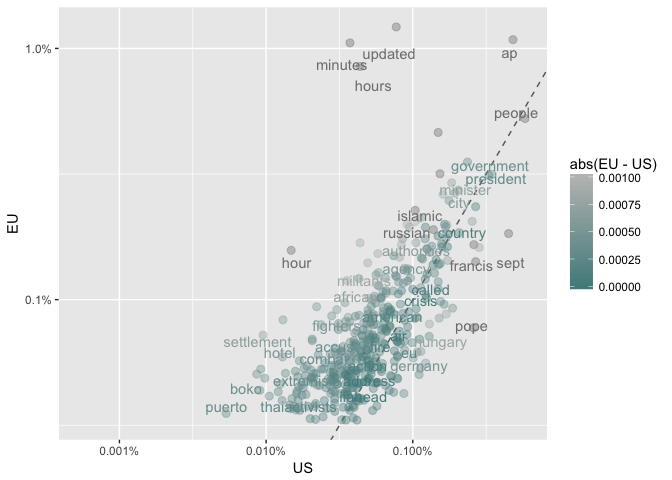
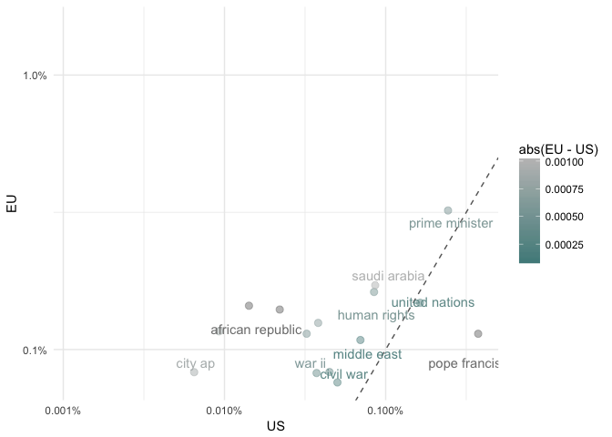
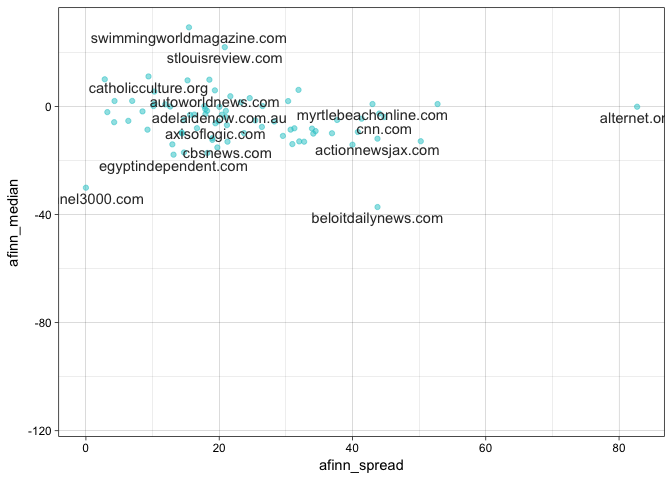
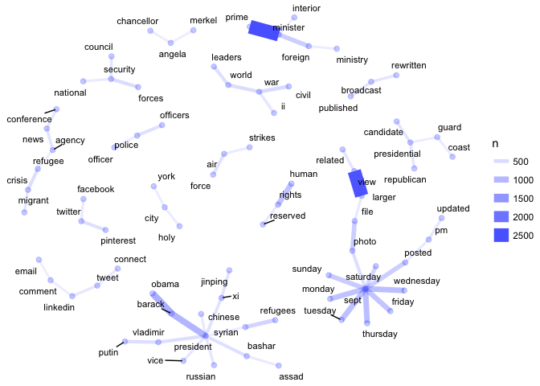
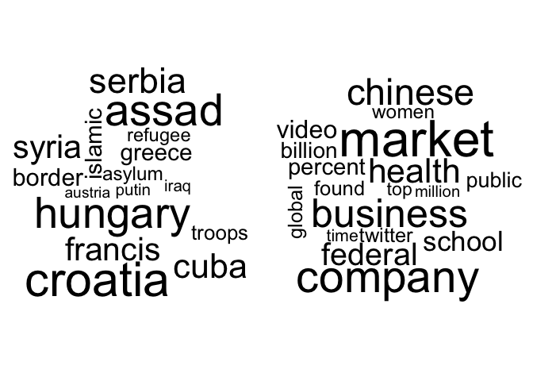

Section 2: NLP
================

-   [Webhose.io](#webhose.io)
    -   [Importing JSON](#importing-json)
-   [Natural Language Processing in R](#natural-language-processing-in-r)
    -   [Tokens](#tokens)
    -   [Word Document Frequency tf-idf](#word-document-frequency-tf-idf)
    -   [Sentiment Analysis](#sentiment-analysis)
    -   [Visualizing Related Words](#visualizing-related-words)
    -   [Topic Modeling](#topic-modeling)
    -   [Further reading](#further-reading)

Webhose.io
==========

Webhose.io provides access to web data feeds on including news, blogs, and discussions. Their free account allows 1,000 API requests per month (with each request limited to 100 results).

We will be using one of their free datasets, which is the results of scraping news articles with the topic of "World news". This dataset contains 60,297 documents and covers September and October of 2015. When you download this archive, you will get a zip folder containing one zip folder for each month. For this section, we will work with the September folder whose name begins like "678\_webhose-2015-09-new\_".

Importing JSON
--------------

The September folder contains 31,776 files each containing one JSON object.

``` r
list.dirs("data")
```

    ## [1] "data"                                       
    ## [2] "data/678_webhose-2015-09-new_20170403170055"

``` r
folder_name <- grep("webhose", list.dirs("data"), value = TRUE)
folder_name
```

    ## [1] "data/678_webhose-2015-09-new_20170403170055"

``` r
news_files <- list.files(folder_name)
length(news_files)
```

    ## [1] 19999

``` r
news_files[1:3]
```

    ## [1] "news_0000001.json" "news_0000002.json" "news_0000003.json"

``` r
head(news_files)
```

    ## [1] "news_0000001.json" "news_0000002.json" "news_0000003.json"
    ## [4] "news_0000004.json" "news_0000005.json" "news_0000006.json"

``` r
tail(news_files, n =10)
```

    ##  [1] "news_0019990.json" "news_0019991.json" "news_0019992.json"
    ##  [4] "news_0019993.json" "news_0019994.json" "news_0019995.json"
    ##  [7] "news_0019996.json" "news_0019997.json" "news_0019998.json"
    ## [10] "news_0019999.json"

Let's get a sense of the JSON structure by looking at the first element

``` r
library(jsonlite)
fromJSON(file(file.path(folder_name, news_files[1])))
```

    ## $organizations
    ## list()
    ## 
    ## $uuid
    ## [1] "797aaced2f1cd22df3c89348c339284dac991bcd"
    ## 
    ## $thread
    ## $thread$site_full
    ## [1] "www.sfgate.com"
    ## 
    ## $thread$main_image
    ## [1] "http://ww3.hdnux.com/photos/41/05/74/8675078/7/rawImage.jpg"
    ## 
    ## $thread$site_section
    ## [1] "http://sfgate.com//rss/feed/World-News-From-SFGate-432.php"
    ## 
    ## $thread$section_title
    ## [1] "World News From SFGate"
    ## 
    ## $thread$url
    ## [1] "http://www.sfgate.com/news/world/article/Who-needs-a-limo-Pope-Francis-opts-for-a-more-6522645.php"
    ## 
    ## $thread$country
    ## [1] "US"
    ## 
    ## $thread$title
    ## [1] "Who needs a limo? Pope Francis opts for a more modest Fiat"
    ## 
    ## $thread$performance_score
    ## [1] 0
    ## 
    ## $thread$site
    ## [1] "sfgate.com"
    ## 
    ## $thread$participants_count
    ## [1] 1
    ## 
    ## $thread$title_full
    ## [1] "Who needs a limo? Pope Francis opts for a more modest Fiat - SFGate"
    ## 
    ## $thread$spam_score
    ## [1] 0
    ## 
    ## $thread$site_type
    ## [1] "news"
    ## 
    ## $thread$published
    ## [1] "2015-09-22T18:27:00.000+03:00"
    ## 
    ## $thread$replies_count
    ## [1] 0
    ## 
    ## $thread$uuid
    ## [1] "797aaced2f1cd22df3c89348c339284dac991bcd"
    ## 
    ## 
    ## $author
    ## [1] "sfgate.com"
    ## 
    ## $url
    ## [1] "http://www.sfgate.com/news/world/article/Who-needs-a-limo-Pope-Francis-opts-for-a-more-6522645.php"
    ## 
    ## $ord_in_thread
    ## [1] 0
    ## 
    ## $title
    ## [1] "Who needs a limo? Pope Francis opts for a more modest Fiat"
    ## 
    ## $locations
    ## list()
    ## 
    ## $entities
    ## $entities$persons
    ## list()
    ## 
    ## $entities$locations
    ## list()
    ## 
    ## $entities$organizations
    ## list()
    ## 
    ## 
    ## $highlightText
    ## [1] ""
    ## 
    ## $language
    ## [1] "english"
    ## 
    ## $persons
    ## list()
    ## 
    ## $text
    ## [1] "Photo: Andrew Harnik, AP Image 1 of / 3 Caption\nClose\nImage 1 of 3 Pope Francis waves from a Fiat 500 as his motorcade departs from Andrews Air Force Base, Md., Tuesday, Sept. 22, 2015, where President and Mrs. Obama welcomed him.\nPhoto: Andrew Harnik, AP Pope Francis waves from a Fiat 500 as his motorcade departs from... Image 2 of 3 Pope Francis arrives at the Apostolic Nunciature, the Vatican's diplomatic mission in the heart of Washington, Tuesday, Sept. 22, 2015, in a Fiat 500. Pope Francis will visit the White House on Wednesday, becoming only the third pope to visit the White House.\nPhoto: Cliff Owen, AP Pope Francis arrives at the Apostolic Nunciature, the Vatican's... Image 3 of 3 Pope Francis waves from a Fiat 500L as his motorcade departs Andrews Air Force Base, Md., Tuesday, Sept. 22, 2015, after being greeted by President Barack Obama and first lady Michelle Obama.\nPhoto: Andrew Harnik, AP Pope Francis waves from a Fiat 500L as his motorcade departs... Who needs a limo? Pope Francis opts for a more modest Fiat 1  /  3 Back to Gallery WASHINGTON (AP) — Pope Francis was hard to spot in the motorcade of more than 20 armed SUVs and police cars that motored into the nation's capital late Tuesday. The pontiff ditched the fancy wheels in favor of a much more modest ride: a Fiat.\nAfter he stepped off his plane at Andrews Air Force Base in neighboring Maryland, Francis was driven into town in the back of a tiny, charcoal gray Fiat 500L. The four-door model was sandwiched between two enormous black SUVs in the motorcade.\nA half-hour or so later, the Italian-made car could be spotted rounding the corner at the Apostolic Nunciature, the Vatican's diplomatic mission, where Francis was spending the night. The small Vatican flag adorning the car did little to make it stand out from the flashing police cars and other vehicles accompanying him.\nFrancis has made a point of using particularly modest cars, part of his emphasis on simplicity, conservatism and rejection of today's consumerist lifestyle. He uses a blue Ford Focus to get around the Vatican, and during his visit to South Korea he used a Kia.\nNot that the Fiat was some little junker. Erik Nyhuis , sales manager at Safford Fiat in Vienna, Virginia, the only local dealer, said the 500L retails from $19,000 to the \"high 20s\" in the United States. It's the largest model available in the U.S.\n\"It's a lot larger inside than you would expect,\" Nyhuis said. \"It's a great little car.\"\nOther popes have been known for their use of the popemobile, the informal name for special vehicles with glass-enclosed viewing areas that let a pope ride through huge crowds without risking his security. Benedict XVI used such a vehicle when he visited Washington in 2008, and Francis is expected to use one for a portion of his city tour on Wednesday.\nThis pope seems less than concerned about his own security. As soon as he got in the back seat, the window was rolled down, allowing him to wave to cheering crowds.\nIt's a sight you wouldn't see in President Barack Obama 's motorcade. The Secret Service keeps the windows in his limousine rolled up to help protect the president.\n___\nAssociated Press writer Ben Nuckols contributed."
    ## 
    ## $external_links
    ## list()
    ## 
    ## $published
    ## [1] "2015-09-22T18:27:00.000+03:00"
    ## 
    ## $crawled
    ## [1] "2015-09-23T01:30:19.553+03:00"
    ## 
    ## $highlightTitle
    ## [1] ""
    ## 
    ## $social
    ## $social$gplus
    ## $social$gplus$shares
    ## [1] 0
    ## 
    ## 
    ## $social$pinterest
    ## $social$pinterest$shares
    ## [1] 0
    ## 
    ## 
    ## $social$vk
    ## $social$vk$shares
    ## [1] 0
    ## 
    ## 
    ## $social$linkedin
    ## $social$linkedin$shares
    ## [1] 0
    ## 
    ## 
    ## $social$facebook
    ## $social$facebook$likes
    ## [1] 0
    ## 
    ## $social$facebook$shares
    ## [1] 0
    ## 
    ## $social$facebook$comments
    ## [1] 0
    ## 
    ## 
    ## $social$stumbledupon
    ## $social$stumbledupon$shares
    ## [1] 0

The variables we care about are `$thread$site`, `$thread$section_title`, `$thread$country`, `$title`, `$text`, and `$published`.

Let's create a data\_frame with these variables.

``` r
library("tidyverse")
```

    ## Loading tidyverse: ggplot2
    ## Loading tidyverse: tibble
    ## Loading tidyverse: tidyr
    ## Loading tidyverse: readr
    ## Loading tidyverse: purrr
    ## Loading tidyverse: dplyr

    ## Conflicts with tidy packages ----------------------------------------------

    ## filter(): dplyr, stats
    ## lag():    dplyr, stats

``` r
get_json_content <- function(filename) {
  json <- fromJSON(file(file.path(folder_name, filename)))
  list(
    site = json$thread$site,
    section_title = json$thread$section_title,
    country = json$thread$country,
    title = json$title,
    text = json$text,
    published_time = json$published
    )
}

news_df <- news_files %>%
  head(10000) %>%
  map_df(~get_json_content(.))
```

Natural Language Processing in R
================================

Now we want to do some analysis with this text data. For much of this section we'll use the `tidytext` package.

Tokens
------

The observations for NLP are tokens. A token can be a word, a phrase (ngram), a sentence, etc.

Here's an example counting the word frequency in these news articles.

``` r
library(tidytext)
news_words <- news_df %>%
  mutate(text = gsub("\n|[[:digit:][:punct:]]+", "", text)) %>%
  unnest_tokens(word, text) %>%
  anti_join(stop_words)
```

    ## Joining, by = "word"

``` r
news_words %>%
  count(word, sort = TRUE)
```

    ## # A tibble: 121,201 x 2
    ##          word     n
    ##         <chr> <int>
    ##  1     people 10818
    ##  2         ap  7808
    ##  3       sept  7645
    ##  4  president  7107
    ##  5 government  6979
    ##  6     police  6113
    ##  7   migrants  5291
    ##  8   minister  4801
    ##  9     border  4640
    ## 10     united  4609
    ## # ... with 121,191 more rows

Let's compare the word proportions in the US to those in the EU

``` r
library(scales)
```

    ## 
    ## Attaching package: 'scales'

    ## The following object is masked from 'package:purrr':
    ## 
    ##     discard

    ## The following object is masked from 'package:readr':
    ## 
    ##     col_factor

``` r
country_proportions <- news_words %>%
  group_by(country) %>%
  count(word, sort = TRUE) %>%
  mutate(proportion = n / sum(n)) %>%
  filter(n > 10) %>%
  select(country, word, proportion) %>%
  filter(country != '') %>%
  spread(country, proportion) 
country_proportions
```

    ## # A tibble: 14,743 x 12
    ##          word           AU    CA    EU          GB    IE           IL
    ##  *      <chr>        <dbl> <dbl> <dbl>       <dbl> <dbl>        <dbl>
    ##  1          â           NA    NA    NA          NA    NA           NA
    ##  2        aap 7.960516e-05    NA    NA          NA    NA           NA
    ##  3      aaron 1.459428e-04    NA    NA          NA    NA           NA
    ##  4         ab           NA    NA    NA          NA    NA           NA
    ##  5    abandon           NA    NA    NA          NA    NA           NA
    ##  6  abandoned 7.297140e-05    NA    NA          NA    NA           NA
    ##  7 abandoning           NA    NA    NA          NA    NA           NA
    ##  8     abassi           NA    NA    NA          NA    NA           NA
    ##  9      abbas           NA    NA    NA          NA    NA 0.0002143684
    ## 10     abbott 6.103062e-04    NA    NA 0.000574985    NA           NA
    ## # ... with 14,733 more rows, and 5 more variables: IN <dbl>, MY <dbl>,
    ## #   SG <dbl>, US <dbl>, ZA <dbl>

``` r
country_proportions %>%
  ggplot(aes(US, EU, color = abs(EU - US))) +
  geom_abline(color = "gray40", lty = 2) +
  geom_jitter(alpha = 0.4, size = 2.5, height = 0.1, width = 0.1) +
  geom_text(aes(label = word), check_overlap = TRUE, vjust = 1.5) + 
  scale_x_log10(labels = percent_format()) +
  scale_y_log10(labels = percent_format()) +
  scale_color_gradient(limits = c(0, 0.001), low = "darkslategray4", high = "gray75")
```

    ## Warning: Removed 14348 rows containing missing values (geom_point).

    ## Warning: Removed 14348 rows containing missing values (geom_text).



Let's do the same with bigrams (ngrams of order 2).

``` r
bigrams <- news_df %>%
  mutate(text = gsub("\n|[[:digit:][:punct:]]+", "", text), id = seq_along(country)) %>%
  unnest_tokens(word, text, token = "ngrams", n = 2) %>%
  separate(word, c("word1", "word2"), sep = " ") %>%
  filter(!word1 %in% stop_words$word & !word2 %in% stop_words$word) %>%
  unite(word, word1, word2, sep = " ")

bigram_proportions <- bigrams %>%
  group_by(country) %>%
  count(word, sort = TRUE) %>%
  mutate(proportion = n / sum(n)) %>%
  filter(n > 10) %>%
  select(country, word, proportion) %>%
  filter(country != '') %>%
  spread(country, proportion) 
bigram_proportions
```

    ## # A tibble: 7,600 x 12
    ##                   word           AU    CA    EU    GB    IE    IL    IN
    ##  *               <chr>        <dbl> <dbl> <dbl> <dbl> <dbl> <dbl> <dbl>
    ##  1       aaron rodgers           NA    NA    NA    NA    NA    NA    NA
    ##  2          abc action 0.0002763661    NA    NA    NA    NA    NA    NA
    ##  3            abc news           NA    NA    NA    NA    NA    NA    NA
    ##  4 abdelfattah elsissi           NA    NA    NA    NA    NA    NA    NA
    ##  5    abdrabbu mansour           NA    NA    NA    NA    NA    NA    NA
    ##  6   abduction slaying           NA    NA    NA    NA    NA    NA    NA
    ##  7        abdul gayoom           NA    NA    NA    NA    NA    NA    NA
    ##  8        abdul rahman           NA    NA    NA    NA    NA    NA    NA
    ##  9         abdullah ii           NA    NA    NA    NA    NA    NA    NA
    ## 10      abdullah saleh           NA    NA    NA    NA    NA    NA    NA
    ## # ... with 7,590 more rows, and 4 more variables: MY <dbl>, SG <dbl>,
    ## #   US <dbl>, ZA <dbl>

``` r
bigram_proportions %>%
  ggplot(aes(US, EU, color = abs(EU - US))) +
  geom_abline(color = "gray40", lty = 2) +
  geom_jitter(alpha = 0.5, size = 2.5, height = 0.1, width = 0.1) +
  geom_text(aes(label = word), check_overlap = TRUE, vjust = 1.5) + 
  scale_x_log10(labels = percent_format()) +
  scale_y_log10(labels = percent_format()) +
  scale_color_gradient(limits = c(0.0001, 0.001), low = "darkslategray4", high = "gray75") +
  theme_minimal()
```

    ## Warning: Removed 7585 rows containing missing values (geom_point).

    ## Warning: Removed 7585 rows containing missing values (geom_text).



Word Document Frequency tf-idf
------------------------------

When we look at the bigrams it is clear that we pick up many of phrases we don't care about. Term frequency inverse document frequency (tf-idf) is an easy way to find important phrases. It is calculated by scaling the frequency of a term within a document by a measure of how rare it is. The measure of rarity, inverse document frequency, is the log of inverse of the proportion of documents containing the term.

``` r
bigrams <- bigrams %>%
  count(id, word) %>%
  bind_tf_idf(word, id, n) %>%
  arrange(desc(tf_idf))
bigrams
```

    ## # A tibble: 836,334 x 6
    ##       id                 word     n    tf      idf   tf_idf
    ##    <int>                <chr> <int> <dbl>    <dbl>    <dbl>
    ##  1  1372       moroccan woman     1     1 9.198369 9.198369
    ##  2  4552   disabled transform     1     1 9.198369 9.198369
    ##  3  6198          blast music     1     1 9.198369 9.198369
    ##  4  6220        watch kaparos     1     1 9.198369 9.198369
    ##  5  7208   distressing images     1     1 9.198369 9.198369
    ##  6  7538 production companies     1     1 8.505222 8.505222
    ##  7  6075  federal regulations     1     1 8.099757 8.099757
    ##  8  9136         limited time     1     1 7.588931 7.588931
    ##  9  1227         flash floods     1     1 7.406610 7.406610
    ## 10  7817        german brands     1     1 7.406610 7.406610
    ## # ... with 836,324 more rows

Sentiment Analysis
------------------

To measure the sentiment in a given text, there are several lexicons in the `tidytext` library. `afinn` gives values between -5 and 5, with positive values indicating positive sentiment. `bing` classifies words as either 'positive' or 'negative'. `nrc` classifies words as either `positive`, `negative`, `anger`, `anticipation`, `disgust`, `fear`, `joy`, `sadness`, `surprise`, or `trust`. `loughran` is designed for financial data and includes the categories `litigious`, `uncertainty`, `constraining`, and `superfluous`.

See the `sentiments` documentation for more information (`?sentiments`).

First let's calculate the

``` r
news_words %>%
  inner_join(get_sentiments("afinn")) %>%
  filter(country == "US") %>%
  group_by(site, title) %>%
  summarize(afinn_sum = sum(score)) %>% 
  summarize(afinn_median = median(afinn_sum), afinn_spread = sd(afinn_sum)) %>%
  ggplot(aes(afinn_spread, afinn_median)) + geom_jitter(color = "#22C7CC", alpha = 0.5) +
  geom_text(aes(label = site), color = "gray20", check_overlap = TRUE, vjust = 1.5) +
  theme_linedraw()
```

    ## Joining, by = "word"

    ## Warning: Removed 6 rows containing missing values (geom_point).

    ## Warning: Removed 6 rows containing missing values (geom_text).



Visualizing Related Words
-------------------------

Related words can be visualized as a network (a.k.a. a graph).

``` r
library(igraph)
```

    ## 
    ## Attaching package: 'igraph'

    ## The following objects are masked from 'package:dplyr':
    ## 
    ##     %>%, as_data_frame, groups, union

    ## The following objects are masked from 'package:purrr':
    ## 
    ##     %>%, compose, simplify

    ## The following objects are masked from 'package:tidyr':
    ## 
    ##     %>%, crossing

    ## The following object is masked from 'package:tibble':
    ## 
    ##     as_data_frame

    ## The following objects are masked from 'package:stats':
    ## 
    ##     decompose, spectrum

    ## The following object is masked from 'package:base':
    ## 
    ##     union

``` r
bigram_counts <- bigrams %>%
  group_by(word) %>%
  summarise(n = sum(n)) %>%
  separate(word, c("word1", "word2"), sep = " ")
bigram_counts
```

    ## # A tibble: 434,854 x 3
    ##    word1        word2     n
    ##  * <chr>        <chr> <int>
    ##  1     â         days     1
    ##  2     â        euros     1
    ##  3     â milesclashes     1
    ##  4     â      million     3
    ##  5     à          nos     1
    ##  6     â       people     1
    ##  7     â    yearcivil     1
    ##  8   aaa midatlantics     1
    ##  9   aaa northeastnew     1
    ## 10   aaa       rating     1
    ## # ... with 434,844 more rows

``` r
bigram_graph <- bigram_counts %>%
  arrange(desc(n)) %>%
  slice(1:100) %>%
  graph_from_data_frame()
bigram_graph
```

    ## IGRAPH DN-- 149 100 -- 
    ## + attr: name (v/c), n (e/n)
    ## + edges (vertex names):
    ##  [1] prime    ->minister pope     ->francis  view     ->larger  
    ##  [4] united   ->nations  barack   ->obama    president->barack  
    ##  [7] saudi    ->arabia   white    ->house    european ->union   
    ## [10] thursday ->sept     wednesday->sept     tuesday  ->sept    
    ## [13] human    ->rights   monday   ->sept     friday   ->sept    
    ## [16] middle   ->east     sunday   ->sept     file     ->photo   
    ## [19] sept     ->posted   foreign  ->minister asylum   ->seekers 
    ## [22] syrian   ->refugees saturday ->sept     civil    ->war     
    ## + ... omitted several edges

We will use another library to visualize the graph.

``` r
library(ggraph)
set.seed(1337)

bigram_components <- components(bigram_graph)
bigram_components
```

    ## $membership
    ##         prime          pope          view        united        barack 
    ##             1             2             3             4             5 
    ##     president         saudi         white      european      thursday 
    ##             5             6             7             8             3 
    ##     wednesday       tuesday         human        monday        friday 
    ##             3             3             9             3             3 
    ##        middle        sunday          file          sept       foreign 
    ##            10             3             3             3             1 
    ##        asylum        syrian      saturday         civil     sponsored 
    ##            11             5             3            12            13 
    ##      security         world         story       climate      vladimir 
    ##            14            12            15            16             5 
    ##       refugee       burkina       twitter        police          told 
    ##            17            18            19            20            21 
    ##           air       million        social            xi        donald 
    ##            22            23            24             5            25 
    ##          news  presidential       related     broadcast     published 
    ##            17            26             3            27            27 
    ##           war       russian         north       migrant    republican 
    ##            12             5            28            17            26 
    ##       updated       supreme          vice         getty         tweet 
    ##             3            29             5            30            31 
    ##          real           los       chinese      facebook        larger 
    ##            32            33             5            19             3 
    ##       connect        alexis        posted        rights         chief 
    ##            31            34             3             9            35 
    ##        bashar          hajj      national          holy         coast 
    ##             5            36            14            37            26 
    ## international         death       western       nuclear       planned 
    ##            38            39            40            41            42 
    ##         times          york    chancellor          wall         greek 
    ##            43            37            44            45            46 
    ##         south      linkedin        border        angela       comment 
    ##            47            31            48            44            31 
    ##          john      interior      minister       francis       nations 
    ##            49             1             1             2             4 
    ##         obama        arabia         house         union          east 
    ##             5             6             7             8            10 
    ##         photo       seekers      refugees         links        forces 
    ##             3            11             5            13            14 
    ##     subscribe        change         putin        crisis          faso 
    ##            15            16             5            17            18 
    ##       leaders     pinterest      officers     reporters         force 
    ##            12            19            20            21            22 
    ##        people         media       jinping         trump        agency 
    ##            23            24             5            25            17 
    ##     candidate       council     rewritten            ii         korea 
    ##            26            14            27            12            28 
    ##            pm         court        images    conference        estate 
    ##             3            29            30            17            32 
    ##       angeles       tsipras      reserved     executive         assad 
    ##            33            34             9            35             5 
    ##    pilgrimage          city       strikes         guard     community 
    ##            36            37            22            26            38 
    ##          toll        europe          deal    parenthood         local 
    ##            39            40            41            42            43 
    ##      ministry        street        island       officer        africa 
    ##             1            45            46            20            47 
    ##      controls        merkel         email       boehner 
    ##            48            44            31            49 
    ## 
    ## $csize
    ##  [1]  5  2 16  2 14  2  2  2  3  2  2  5  2  4  2  2  6  2  3  3  2  3  2
    ## [24]  2  2  5  3  2  2  2  5  2  2  2  2  2  3  2  2  2  2  2  2  3  2  2
    ## [47]  2  2  2
    ## 
    ## $no
    ## [1] 49

``` r
bigram_graph %>%
  induced_subgraph(bigram_components$csize[bigram_components$membership] > 2) %>%
  ggraph(layout = "fr") +
  geom_edge_link(aes(edge_alpha = n, edge_width = n), edge_colour = "#596BFF") +
  geom_node_point(size = 2, alpha = 0.3, color = "#596BFF") +
  geom_node_text(aes(label = name), size = 3, vjust = 1, hjust = 1, repel = TRUE,
                 point.padding = unit(0.2, "lines")) +
  theme_void()
```

    ## Warning: Ignoring unknown parameters: vjust, hjust



Topic Modeling
--------------

The latent Dirchlet allocation (LDA) models documents as mixtures of topics and models topics as mixtures of words.

To begin with, we need to transform our news words into a document-term matrix.

``` r
news_dtm <- news_words %>%
  group_by(title, word) %>%
  summarize(count = n()) %>%
  cast_dtm(title, word, count)
news_dtm
```

    ## <<DocumentTermMatrix (documents: 8258, terms: 121201)>>
    ## Non-/sparse entries: 1185928/999691930
    ## Sparsity           : 100%
    ## Maximal term length: 174
    ## Weighting          : term frequency (tf)

To estimate the topics using LDA, we'll use the `topicmodels` package.

``` r
library(topicmodels)
news_lda <- LDA(news_dtm, k = 2, control = list(seed = 1337))
news_topics <- tidy(news_lda, matrix = "beta")
news_topics
```

    ## # A tibble: 242,402 x 3
    ##    topic      term         beta
    ##    <int>     <chr>        <dbl>
    ##  1     1 acclaimed 4.973762e-06
    ##  2     2 acclaimed 9.145090e-06
    ##  3     1     added 5.393060e-04
    ##  4     2     added 5.602238e-04
    ##  5     1 admission 2.519615e-05
    ##  6     2 admission 4.066899e-05
    ##  7     1  admitted 5.724267e-05
    ##  8     2  admitted 2.435764e-04
    ##  9     1 admitting 1.765649e-05
    ## 10     2 admitting 3.506438e-05
    ## # ... with 242,392 more rows

``` r
news_top_terms <- news_topics %>%
  group_by(topic) %>%
  top_n(10, beta) %>%
  ungroup() %>%
  arrange(topic, -beta)
news_top_terms
```

    ## # A tibble: 20 x 3
    ##    topic       term        beta
    ##    <int>      <chr>       <dbl>
    ##  1     1     people 0.007157700
    ##  2     1       sept 0.005704862
    ##  3     1         ap 0.005371211
    ##  4     1  president 0.005054175
    ##  5     1   migrants 0.004943512
    ##  6     1 government 0.004582933
    ##  7     1     police 0.004351965
    ##  8     1     border 0.004335165
    ##  9     1   refugees 0.004168018
    ## 10     1       pope 0.004102620
    ## 11     2     people 0.002983750
    ## 12     2       time 0.002723823
    ## 13     2      world 0.002193849
    ## 14     2    percent 0.002192947
    ## 15     2 government 0.001960004
    ## 16     2         ap 0.001946124
    ## 17     2    million 0.001929212
    ## 18     2      china 0.001919956
    ## 19     2      photo 0.001913891
    ## 20     2       told 0.001902686

More interesting than the top terms in each topic are the terms with the greatest difference in probability of allocation to a given topic.

``` r
beta_spread <- news_topics %>%
  mutate(topic = paste0("topic", topic)) %>%
  spread(topic, beta) %>%
  filter(topic1 > .001 | topic2 > .001) %>%
  mutate(log_ratio = log2(topic2 / topic1))
beta_spread
```

    ## # A tibble: 138 x 4
    ##           term      topic1       topic2  log_ratio
    ##          <chr>       <dbl>        <dbl>      <dbl>
    ##  1      agency 0.001108124 5.471807e-04  -1.018030
    ##  2         air 0.001175456 4.280401e-04  -1.457403
    ##  3          ap 0.005371211 1.946124e-03  -1.464643
    ##  4        army 0.001080544 4.394810e-05  -4.619813
    ##  5       assad 0.001047378 1.855861e-13 -32.393974
    ##  6    assembly 0.001035374 4.805503e-05  -4.429320
    ##  7      asylum 0.001426943 7.127627e-07 -10.967219
    ##  8      attack 0.001169008 1.850637e-04  -2.659191
    ##  9     austria 0.001007401 5.469313e-06  -7.525063
    ## 10 authorities 0.001401486 5.944507e-04  -1.237328
    ## # ... with 128 more rows

``` r
beta_spread %>%
  top_n(10, log_ratio) %>%
  arrange(log_ratio)
```

    ## # A tibble: 10 x 4
    ##        term       topic1      topic2 log_ratio
    ##       <chr>        <dbl>       <dbl>     <dbl>
    ##  1    video 3.577755e-04 0.001351522  1.917459
    ##  2   school 2.628874e-04 0.001169651  2.153561
    ##  3  federal 1.820701e-04 0.001037812  2.510979
    ##  4    china 3.302393e-04 0.001919956  2.539489
    ##  5   health 1.597231e-04 0.001093493  2.775300
    ##  6 facebook 1.266891e-04 0.001029565  3.022671
    ##  7  chinese 1.580670e-04 0.001346557  3.090668
    ##  8 business 9.852905e-05 0.001005125  3.350682
    ##  9  company 1.007609e-04 0.001483908  3.880394
    ## 10   market 4.774266e-05 0.001041374  4.447066

Using a word cloud can give us an intuition about the represented topics.

``` r
library(wordcloud)
```

    ## Loading required package: RColorBrewer

``` r
par(mfrow=c(1,2))
beta_spread %>%
  with(wordcloud(term, (-log_ratio) * 10, max.words = 20))
```

    ## Warning in wordcloud(term, (-log_ratio) * 10, max.words = 20): syrian could
    ## not be fit on page. It will not be plotted.

    ## Warning in wordcloud(term, (-log_ratio) * 10, max.words = 20): refugees
    ## could not be fit on page. It will not be plotted.

    ## Warning in wordcloud(term, (-log_ratio) * 10, max.words = 20): migrants
    ## could not be fit on page. It will not be plotted.

    ## Warning in wordcloud(term, (-log_ratio) * 10, max.words = 20): pope could
    ## not be fit on page. It will not be plotted.

``` r
beta_spread %>%
  with(wordcloud(term, log_ratio * 10, max.words = 20))
```

    ## Warning in wordcloud(term, log_ratio * 10, max.words = 20): china could not
    ## be fit on page. It will not be plotted.

    ## Warning in wordcloud(term, log_ratio * 10, max.words = 20): facebook could
    ## not be fit on page. It will not be plotted.



Further reading
---------------

-   [WordNet](http://wordnet.princeton.edu/) and the [`wordnet` library](https://cran.r-project.org/web/packages/wordnet/vignettes/wordnet.pdf)
-   Python Natural Language Toolkit ([NLTK](http://www.nltk.org/)).
-   Notes from a leader in NLP: <http://www.cs.columbia.edu/~mcollins/>
-   [Stanford NLP tools (Java)](https://nlp.stanford.edu/software/)
-   [RelEx Semantic Relation Extractor (Java)](https://github.com/opencog/relex)
