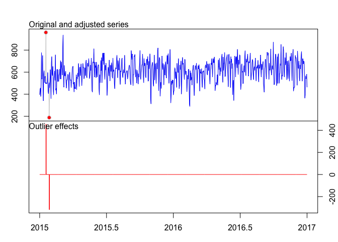

Section 3: Anomaly Detection
================

-   [Introduction](#introduction)
-   [Problem](#problem)
-   [Data](#data)
    -   [Data Summary](#data-summary)
    -   [Training Set](#training-set)
    -   [ggTimeSeries](#ggtimeseries)
-   [Modeling](#modeling)
    -   [Naive Model](#naive-model)
-   [Twitter's Anomaly Detection Library](#twitters-anomaly-detection-library)
-   [Anomalous](#anomalous)
-   [tsoutliers](#tsoutliers)

Introduction
------------

Anomalies are deviations from the norm or our expectations.

For modeling a time-series we need to find a stationary representation. If we have a non-stationary series (e.g., always growing), each new value may be outside of the bounds of the past observations. In this case we cannot build an expectation as a summary of past observations without including the growth rate. The first difference of such a series may be stationary, in which case we can model the fluctuations about its growth path.

The rest of this discussion focuses on the case of stationary series.

The general goal is

1.  Form a prediction/expected range
2.  Flag individuals that are outside of the expected range

Problem
-------

The problem we will look at in this section is identifying anomalies in time series. Time series can be represented in the time dimension, the frequency dimension, or via delay embeddings. We'll focus on the time dimension for this section.

Data
----

The date we'll use is the [NYC vehicle collision data set available on Kaggle](https://www.kaggle.com/nypd/vehicle-collisions).

``` r
rm(list=ls())
library(tidyverse)
```

    ## Loading tidyverse: ggplot2
    ## Loading tidyverse: tibble
    ## Loading tidyverse: tidyr
    ## Loading tidyverse: readr
    ## Loading tidyverse: purrr
    ## Loading tidyverse: dplyr

    ## Conflicts with tidy packages ----------------------------------------------

    ## filter(): dplyr, stats
    ## lag():    dplyr, stats

``` r
collisions <- read_csv('data/vehicle-collisions.csv')
```

    ## Parsed with column specification:
    ## cols(
    ##   .default = col_character(),
    ##   `UNIQUE KEY` = col_integer(),
    ##   TIME = col_time(format = ""),
    ##   `ZIP CODE` = col_integer(),
    ##   LATITUDE = col_double(),
    ##   LONGITUDE = col_double(),
    ##   `PERSONS INJURED` = col_integer(),
    ##   `PERSONS KILLED` = col_integer(),
    ##   `PEDESTRIANS INJURED` = col_integer(),
    ##   `PEDESTRIANS KILLED` = col_integer(),
    ##   `CYCLISTS INJURED` = col_integer(),
    ##   `CYCLISTS KILLED` = col_integer(),
    ##   `MOTORISTS INJURED` = col_integer(),
    ##   `MOTORISTS KILLED` = col_integer()
    ## )

    ## See spec(...) for full column specifications.

### Data Summary

Let's see the bounds of the time series and pick a range for our test set.

``` r
library(lubridate)
```

    ## 
    ## Attaching package: 'lubridate'

    ## The following object is masked from 'package:base':
    ## 
    ##     date

``` r
collisions <- collisions %>%
  mutate(
    date = mdy(DATE),
    day_of_week = wday(date, label = TRUE),
    day_of_month = mday(date)
    )
collisions %>%
  summarise(start = min(date), end = max(date))
```

    ## # A tibble: 1 x 2
    ##        start        end
    ##       <date>     <date>
    ## 1 2015-01-01 2017-02-28

For this section, we will use 2015 and 2016 for our training set. Having two full years of data is useful for finding normal bounds within the seasonality, which is most likely present in this data.

### Training Set

Let's create our `training` set and check the seasonality assumption.

``` r
training <- collisions %>%
  filter(date < ymd("2017-01-01"))
training_months <- training %>%
  mutate(month = as.factor(month(date, label = TRUE)),
         year = as.factor(year(date))) %>%
  group_by(month, year) %>%
  summarize(
    fatalities = sum(`PERSONS KILLED`) / days_in_month(first(date)),
    collisions = n() / days_in_month(first(date)),
    death_rate = fatalities / collisions) %>%
  summarize(
    fatalities = mean(fatalities),
    collisions = mean(collisions),
    death_rate = mean(death_rate)
  )
training_months
```

    ## # A tibble: 12 x 4
    ##    month fatalities collisions   death_rate
    ##    <ord>      <dbl>      <dbl>        <dbl>
    ##  1   Jan  0.5322581   551.9516 0.0009658652
    ##  2   Feb  0.6133005   556.1749 0.0011034721
    ##  3   Mar  0.3870968   587.2581 0.0006601031
    ##  4   Apr  0.5500000   585.2000 0.0009530220
    ##  5   May  0.8225806   634.0161 0.0013015467
    ##  6   Jun  0.7500000   637.1833 0.0011752072
    ##  7   Jul  0.6612903   622.8871 0.0010617911
    ##  8   Aug  0.8064516   623.3548 0.0012913174
    ##  9   Sep  0.5166667   633.2500 0.0008143934
    ## 10   Oct  0.7258065   637.1613 0.0011388161
    ## 11   Nov  0.7166667   622.1500 0.0011617334
    ## 12   Dec  0.7419355   614.0161 0.0012079442

``` r
training_months %>%
  ggplot(aes(month, collisions)) + geom_col() + ylim(0,NA) + 
  ggtitle("Average number of collisions per day")
```


What about the number of fatalities?

``` r
ggplot(training_months, aes(month, fatalities)) + geom_col() + ylim(0,NA) + 
  ggtitle("Average number of fatalities per day")
```


Does there appear to be seasonality in the rate of fatalities per collision?

``` r
ggplot(training_months, aes(month, death_rate)) + geom_col() + ylim(0,NA) + 
  ggtitle("Death by collision rate")
```


To accurately assess the level of seasonality, it would be best for us to have multiple years. To avoid overfitting, we will live within the limits of only using one year of training data. It is clear from even this small sample that had we only selected January through March we would underestimate the number of traffic fatalities for all but September.

Let's see if there appears to be a pattern with respect to days of the week and days of the month.

``` r
training_days <- training %>%
  group_by(date) %>%
  summarize(
    fatalities = sum(`PERSONS KILLED`),
    day_of_week = first(day_of_week)
    )
ggplot(training_days, aes(day_of_week, fatalities)) + geom_violin()
```


Total deaths by day of the week:

``` r
ggplot(training_days, aes(day_of_week, fatalities)) + geom_col()
```


And now fatalities by day of the month:

``` r
training_dates <- training %>%
  group_by(day_of_month) %>%
  summarize(fatalities = sum(`PERSONS KILLED`))

ggplot(training_dates, 
       aes(((day_of_month - 1) %% 7) + 1, ((day_of_month - 1) %/% 7) + 1)) +
  geom_raster(aes(fill = fatalities)) + ylim(5,0) +
  ylab("") + xlab("") + ggtitle("Calendar Heatmap")
```


### ggTimeSeries

``` r
library(ggTimeSeries)

training_series <- training %>%
  group_by(date) %>%
  summarize(
    collisions = n(), 
    injuries = sum(`PERSONS INJURED`), 
    fatalities = sum(`PERSONS KILLED`)
    )

training_series %>%
  ggplot_calendar_heatmap('date', 'collisions') + xlab(NULL) + 
  ylab(NULL) + 
  scale_fill_continuous(low = 'white', high = 'darkred') + 
  facet_wrap(~Year, ncol = 1) +
  theme(
    legend.position = "none",
    strip.background = element_blank(),
    plot.background = element_blank(),
    axis.ticks = element_blank(),
    panel.background = element_blank(),
    panel.border = element_blank(),
    panel.grid = element_blank()
  ) + ggtitle("Vehicle Collisions")
```


Modeling
--------

Let's start by predicting the number of collisions per day.

``` r
ggplot(training_series, aes(date, collisions)) + geom_line()
```


### Naive Model

A simple approach is to assume a roughly Gaussian process and to use a rule that we want to flag observations that are very unlikely.

Let's see how Gaussian this data is:

``` r
ggplot(training_series, aes(collisions)) + geom_density() +
  stat_function(fun=dnorm, color = "red", args = list(mean = mean(training_series$collisions), sd = sd(training_series$collisions)))
```


For rarer events, we'll predict the number of injuries (or fatalities).

A simple anomaly detector can flag days where the observations are greater than x standard deviations from the mean.

``` r
mean_collisions = mean(training_series$collisions)
sd_collisions = sd(training_series$collisions)
moderate_collisions = mean_collisions + sd_collisions
high_collisions = mean_collisions + 2 * sd_collisions
extreme_collisions = mean_collisions + 3 * sd_collisions

ggplot(training_series, aes(date, collisions)) + 
  geom_hline(yintercept = moderate_collisions, color = "yellow") +
  geom_hline(yintercept = high_collisions, color = "orange") +
  geom_hline(yintercept = extreme_collisions, color = "red") +
  geom_line() +
  geom_point(data = training_series[training_series$collisions > extreme_collisions,], color = "red")
```


Twitter's Anomaly Detection Library
-----------------------------------

See a blog post of this [here](https://blog.twitter.com/engineering/en_us/a/2015/introducing-practical-and-robust-anomaly-detection-in-a-time-series.html) and the paper describing their algorithm [here](https://www.usenix.org/system/files/conference/hotcloud14/hotcloud14-vallis.pdf). A common approach to time series modeling is Seasonal and Trend decomposition with LOESS ([Chapter on this topic](https://www.otexts.org/fpp/6/5)). The S-H-ESD algorithm in Twitter's library uses a piece-wise median

Install using the following commands

    install.packages("devtools")
    devtools::install_github("twitter/AnomalyDetection")

``` r
library(AnomalyDetection)
ts_result = training_series %>%
  mutate(datetime = as_datetime(date)) %>%
  select(datetime, collisions) %>%
  AnomalyDetectionTs(max_anoms=0.02, longterm = TRUE, piecewise_median_period_weeks = 8, direction='pos', plot=TRUE)
ts_result$plot
```


``` r
cbind(date = as.character(ts_result$anoms$timestamp), anoms = ts_result$anoms$anoms)
```

    ##      date         anoms
    ## [1,] "2015-01-18" "960"
    ## [2,] "2015-03-06" "936"
    ## [3,] "2015-09-08" "795"
    ## [4,] "2016-09-13" "778"

Anomalous
---------

``` r
#devtools::install_github("robjhyndman/anomalous")
library(anomalous)
```

    ## Loading required package: ForeCA

    ## Loading required package: ifultools

    ## This is 'ForeCA' version 0.2.4. Please see the NEWS file and citation("ForeCA").
    ## May the ForeC be with you.

    ## This is anomalous 0.1.0

``` r
y <- tsmeasures(training_series %>% select(collisions, injuries, fatalities))
y
```

    ##      lumpiness   entropy       ACF1   lshift   vchange cpoints fspots
    ## [1,] 0.2964439 0.8880324 0.39530334 1.422830 0.8709014     246      5
    ## [2,] 0.1329763 0.8614361 0.53987552 1.158941 0.6965597     184      7
    ## [3,] 0.5994245 0.9901392 0.04575333 1.156558 1.1295512      54      9
    ##      trend  linearity     curvature    spikiness  KLscore change.idx
    ## [1,]     0  5.8617111 -1.611424e+00 4.263699e-06 13.60544        358
    ## [2,]     0 12.3845325 -2.344305e+00 2.233773e-06 10.13463         18
    ## [3,]     0  0.5661784 -1.639295e-10 1.020188e-05 13.78218         79
    ## attr(,"class")
    ## [1] "features" "matrix"

tsoutliers
----------

`tsoutliers` is another library providing outlier detection based on the methods of Chen and Liu (1993)

``` r
#install.packages("tsoutliers")
library(tsoutliers)

collisions_ts <- ts(training_series$collisions, c(2015, 1), frequency = 365)

collisions_outliers <- tso(y = collisions_ts)
collisions_outliers
```

    ## Series: collisions_ts 
    ## Regression with ARIMA(1,1,3)             errors 
    ## 
    ## Coefficients:
    ##          ar1      ma1      ma2     ma3      AO18       AO27
    ##       0.6033  -1.1471  -0.1200  0.2815  453.2430  -317.2128
    ## s.e.  0.3484   0.3438   0.1966  0.1439   78.2912    78.3034
    ## 
    ## sigma^2 estimated as 7795:  log likelihood=-4304.96
    ## AIC=8623.92   AICc=8624.07   BIC=8656.07
    ## 
    ## Outliers:
    ##   type ind    time coefhat  tstat
    ## 1   AO  18 2015:18   453.2  5.789
    ## 2   AO  27 2015:27  -317.2 -4.051

Type `AO` stands for Additive Outlier.

`tsoutliers` also provides a handy visualization of the identified outlier.

``` r
plot(collisions_outliers)
```


